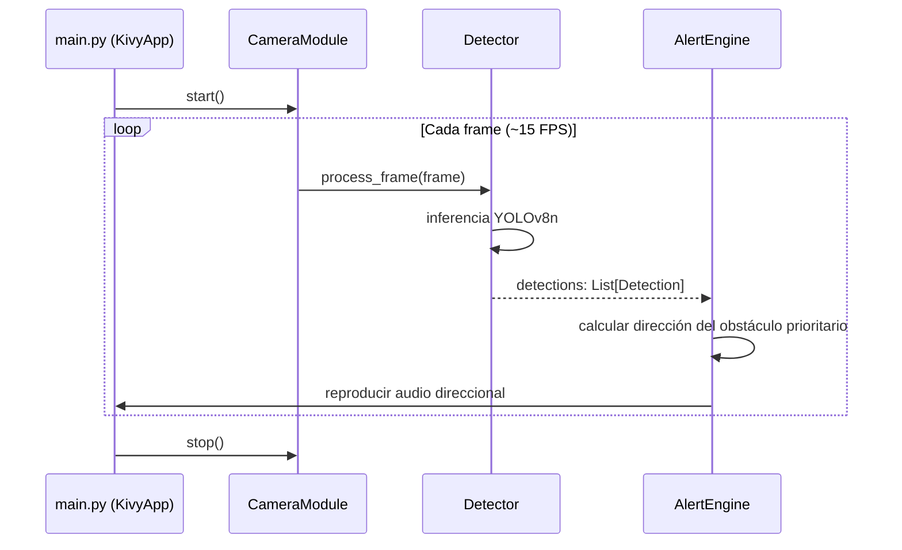

# Design Document: SafeStep UNCP

## Overview

SafeStep UNCP es una aplicación móvil de Edge AI para asistencia a estudiantes con discapacidad visual en la Universidad Nacional del Centro del Perú. La aplicación captura video en tiempo real, detecta obstáculos (personas, sillas, mochilas) usando YOLOv8n y emite alertas de audio direccionales (izquierda/derecha) para guiar al usuario de forma segura. Todo el procesamiento ocurre localmente en el dispositivo Android, sin requerir conexión a internet.

**Stack tecnológico:**
- **Lenguaje:** Python 3.10+
- **UI y empaquetado APK:** Kivy 2.3.x
- **Detección de objetos:** YOLOv8n via `ultralytics` 8.x
- **Captura de video:** OpenCV (`opencv-python`) 4.x
- **Empaquetado Android:** Buildozer 1.5.x
- **Re-entrenamiento futuro:** Azure Machine Learning (AML)

---

## Architecture

El sistema sigue una arquitectura de **pipeline secuencial en tiempo real** con cuatro componentes principales que se comunican de forma unidireccional:

```
┌─────────────────────────────────────────────────────────────────┐
│                        SafeStep_App (Kivy)                      │
│                                                                 │
│  ┌──────────────┐    Frame    ┌──────────────┐                  │
│  │ Camera_Module│ ──────────► │   Detector   │                  │
│  │  (OpenCV)    │             │  (YOLOv8n)   │                  │
│  └──────────────┘             └──────┬───────┘                  │
│                                      │ BoundingBoxes            │
│                                      ▼                          │
│                              ┌──────────────┐                   │
│                              │ Alert_Engine │                   │
│                              │  (Kivy Audio)│                   │
│                              └──────────────┘                   │
│                                                                 │
│  ┌──────────────────────────────────────────────────────────┐   │
│  │  main.py (KivyApp + UI Controller + Lifecycle Manager)   │   │
│  └──────────────────────────────────────────────────────────┘   │
└─────────────────────────────────────────────────────────────────┘

Almacenamiento local:
  models/yolov8n.pt        ← Model_File
  assets/alert_left.wav    ← Audio izquierda
  assets/alert_right.wav   ← Audio derecha
  assets/pause.wav         ← Confirmación pausa
  assets/resume.wav        ← Confirmación reanudación
  assets/no_camera.wav     ← Error de cámara
  assets/no_model.wav      ← Error de modelo
```

### Flujo de datos principal

```
[Cámara] → Frame (numpy array) → [Detector] → List[Detection] → [Alert_Engine] → Audio
```

Cada ciclo de procesamiento ocurre en un hilo de fondo (`threading.Thread`) para no bloquear el hilo principal de Kivy. El hilo principal gestiona la UI y el ciclo de vida de la aplicación.

### Diagrama de secuencia (ciclo de detección)



---

## Components and Interfaces

### 1. `CameraModule` (`src/camera_module.py`)

Responsable de gestionar el ciclo de vida de la cámara y proveer frames al Detector.

```python
class CameraModule:
    def start() -> None
        """Abre la cámara trasera (índice 0) con OpenCV y comienza la captura."""

    def stop() -> None
        """Libera el recurso de la cámara (cv2.VideoCapture.release())."""

    def read_frame() -> Optional[np.ndarray]
        """Captura y retorna un frame como array numpy BGR. Retorna None si falla."""

    def is_open() -> bool
        """Retorna True si la cámara está activa y capturando."""
```

**Dependencias:** `cv2` (OpenCV)
**Estado interno:** `_cap: cv2.VideoCapture`, `_is_running: bool`

---

### 2. `Detector` (`src/detector.py`)

Responsable de cargar el modelo YOLOv8n y ejecutar inferencia sobre frames.

```python
class Detector:
    def __init__(model_path: str, confidence_threshold: float = 0.50) -> None
        """Carga el Model_File desde model_path. Lanza FileNotFoundError si no existe."""

    def detect(frame: np.ndarray) -> List[Detection]
        """Ejecuta inferencia YOLOv8n sobre el frame. Retorna lista de Detection filtradas
        por confidence_threshold. Solo retorna clases: person, chair, backpack."""

    def is_model_loaded() -> bool
        """Retorna True si el Model_File fue cargado exitosamente."""
```

**Estructura `Detection` (dataclass):**
```python
@dataclass
class Detection:
    class_name: str        # "person" | "chair" | "backpack"
    confidence: float      # 0.50 ≤ confidence ≤ 1.0
    bbox: BoundingBox      # coordenadas del rectángulo delimitador

@dataclass
class BoundingBox:
    x1: float   # coordenada izquierda (píxeles)
    y1: float   # coordenada superior (píxeles)
    x2: float   # coordenada derecha (píxeles)
    y2: float   # coordenada inferior (píxeles)

    @property
    def center_x(self) -> float: ...   # (x1 + x2) / 2
    @property
    def area(self) -> float: ...       # (x2 - x1) * (y2 - y1)
```

**Dependencias:** `ultralytics.YOLO`, `numpy`
**Clases objetivo:** `{0: "person", 56: "chair", 24: "backpack"}` (índices COCO)

---

### 3. `AlertEngine` (`src/alert_engine.py`)

Responsable de determinar la dirección del obstáculo prioritario y reproducir el audio correspondiente.

```python
class AlertEngine:
    def __init__(assets_path: str) -> None
        """Carga los archivos de audio desde assets_path."""

    def process_detections(detections: List[Detection], frame_width: int) -> None
        """Determina el obstáculo prioritario, calcula su dirección y reproduce el audio.
        Si detections está vacío, permanece en silencio."""

    def get_priority_detection(detections: List[Detection]) -> Optional[Detection]
        """Retorna la Detection con mayor área de BoundingBox. None si lista vacía."""

    def classify_direction(bbox: BoundingBox, frame_width: int) -> str
        """Retorna 'left' si center_x < frame_width/2, 'right' en caso contrario."""

    def play_alert(direction: str) -> None
        """Reproduce el archivo de audio correspondiente a la dirección.
        Suprime la alerta si ya se está reproduciendo una del mismo tipo."""

    def play_message(message_key: str) -> None
        """Reproduce un mensaje de audio por clave: 'pause', 'resume', 'no_camera', 'no_model'."""

    def is_playing() -> bool
        """Retorna True si hay un audio siendo reproducido actualmente."""
```

**Dependencias:** `kivy.core.audio.SoundLoader`
**Estado interno:** `_current_alert: Optional[str]`, `_sounds: Dict[str, Sound]`

---

### 4. `main.py` (`src/main.py`)

Punto de entrada de la aplicación Kivy. Gestiona el ciclo de vida, la UI y el hilo de procesamiento.

```python
class SafeStepApp(App):
    def build() -> Widget
        """Construye la UI: CameraWidget en pantalla completa + overlay de estado."""

    def on_start() -> None
        """Inicializa CameraModule, Detector y AlertEngine. Inicia el hilo de detección."""

    def on_stop() -> None
        """Detiene el hilo de detección y libera la cámara."""

    def on_pause() -> bool
        """Libera la cámara al pasar a segundo plano. Retorna True para permitir pausa."""

    def on_resume() -> None
        """Reanuda la captura de video al volver al primer plano."""

    def toggle_detection(touch) -> None
        """Pausa o reanuda la detección al recibir un toque en pantalla."""

    def _detection_loop() -> None
        """Bucle de detección ejecutado en hilo de fondo. Lee frames, detecta y alerta."""
```

---

## Data Models

### `Detection`

| Campo | Tipo | Descripción |
|-------|------|-------------|
| `class_name` | `str` | Clase del objeto: `"person"`, `"chair"`, `"backpack"` |
| `confidence` | `float` | Puntuación de confianza: `0.50 ≤ confidence ≤ 1.0` |
| `bbox` | `BoundingBox` | Rectángulo delimitador en coordenadas de píxeles |

### `BoundingBox`

| Campo | Tipo | Descripción |
|-------|------|-------------|
| `x1` | `float` | Coordenada X del borde izquierdo |
| `y1` | `float` | Coordenada Y del borde superior |
| `x2` | `float` | Coordenada X del borde derecho |
| `y2` | `float` | Coordenada Y del borde inferior |
| `center_x` | `float` (property) | `(x1 + x2) / 2` |
| `area` | `float` (property) | `(x2 - x1) * (y2 - y1)` |

### Invariantes de datos

- `x1 < x2` y `y1 < y2` para todo `BoundingBox` válido
- `0.50 ≤ confidence ≤ 1.0` para toda `Detection` retornada por el `Detector`
- `class_name ∈ {"person", "chair", "backpack"}` para toda `Detection`
- `area > 0` para todo `BoundingBox` válido

### Archivos de audio (`assets/`)

| Clave | Archivo | Descripción |
|-------|---------|-------------|
| `left` | `alert_left.wav` | Alerta de obstáculo a la izquierda |
| `right` | `alert_right.wav` | Alerta de obstáculo a la derecha |
| `pause` | `pause.wav` | Confirmación de pausa de detección |
| `resume` | `resume.wav` | Confirmación de reanudación de detección |
| `no_camera` | `no_camera.wav` | Error: cámara no disponible |
| `no_model` | `no_model.wav` | Error: modelo no encontrado |

---

## Correctness Properties

*Una propiedad es una característica o comportamiento que debe mantenerse verdadero en todas las ejecuciones válidas del sistema — esencialmente, una declaración formal sobre lo que el sistema debe hacer. Las propiedades sirven como puente entre las especificaciones legibles por humanos y las garantías de corrección verificables por máquina.*

### Property 1: Invariante de clases detectadas

*Para cualquier* frame de video procesado por el Detector, todas las detecciones retornadas deben pertenecer exclusivamente al conjunto de clases `{"person", "chair", "backpack"}`.

**Validates: Requirements 2.2**

---

### Property 2: Invariante de umbral de confianza

*Para cualquier* frame de video procesado por el Detector, todas las detecciones retornadas deben tener un `confidence` mayor o igual a `0.50`.

**Validates: Requirements 2.4**

---

### Property 3: Estructura válida de detecciones

*Para cualquier* frame de video procesado por el Detector, cada `Detection` retornada debe tener: `class_name` en el conjunto válido, `confidence ∈ [0.50, 1.0]`, y un `BoundingBox` con `x1 < x2` e `y1 < y2`.

**Validates: Requirements 2.3, 2.4**

---

### Property 4: Clasificación direccional correcta

*Para cualquier* `BoundingBox` y ancho de frame `W > 0`, si `center_x < W/2` entonces la dirección clasificada debe ser `"left"`, y si `center_x >= W/2` entonces debe ser `"right"`. La clasificación debe cubrir todos los casos posibles sin ambigüedad.

**Validates: Requirements 3.2, 3.3**

---

### Property 5: Selección del obstáculo prioritario por área máxima

*Para cualquier* lista no vacía de detecciones, el obstáculo prioritario seleccionado por `get_priority_detection` debe tener el área de `BoundingBox` mayor o igual al área de todas las demás detecciones en la lista.

**Validates: Requirements 3.4**

---

### Property 6: Silencio ante ausencia de obstáculos

*Para cualquier* llamada a `process_detections` con una lista vacía de detecciones, el `AlertEngine` no debe reproducir ningún audio de alerta direccional.

**Validates: Requirements 4.5**

---

### Property 7: Supresión de alertas duplicadas (idempotencia)

*Para cualquier* estado del `AlertEngine` donde ya se está reproduciendo una alerta de dirección `D`, intentar reproducir nuevamente una alerta de la misma dirección `D` no debe iniciar una nueva reproducción superpuesta.

**Validates: Requirements 4.4**

---

### Property 8: Toggle de detección (round-trip)

*Para cualquier* estado de detección (activo o pausado), aplicar `toggle_detection` dos veces consecutivas debe retornar el sistema al estado original.

**Validates: Requirements 5.3**

---

### Property 9: Invariante de BoundingBox válido

*Para cualquier* `BoundingBox` generado por el Detector, debe cumplirse que `x1 < x2`, `y1 < y2`, y `area > 0`.

**Validates: Requirements 2.3**

> **Nota de reflexión sobre propiedades:** Las propiedades 3 y 9 se solapan parcialmente. La Property 3 es más comprehensiva (incluye clase, confianza y bbox), por lo que la Property 9 queda subsumida. Se mantiene como referencia explícita para la invariante de BoundingBox. Las propiedades 1 y 2 son casos específicos de la Property 3, pero se mantienen separadas para facilitar el diagnóstico de fallos en tests.

---

## Error Handling

### Errores de inicialización

| Condición | Módulo | Respuesta |
|-----------|--------|-----------|
| Cámara no disponible / permiso denegado | `CameraModule` | `is_open()` retorna `False`; `main.py` reproduce `no_camera.wav` |
| `Model_File` no encontrado | `Detector` | Lanza `FileNotFoundError`; `main.py` captura la excepción y reproduce `no_model.wav` |
| Archivo de audio faltante | `AlertEngine` | Registra advertencia en log; omite la reproducción sin crashear |

### Errores en tiempo de ejecución

| Condición | Módulo | Respuesta |
|-----------|--------|-----------|
| `read_frame()` retorna `None` | `CameraModule` | El bucle de detección omite el frame y continúa |
| Excepción durante inferencia YOLOv8n | `Detector` | Captura la excepción, retorna lista vacía, registra en log |
| Error de reproducción de audio | `AlertEngine` | Captura la excepción, registra en log, no interrumpe el bucle |

### Estrategia general

- **Fail-safe:** Ante cualquier error en el pipeline de detección, el sistema continúa operando (no crashea). El usuario puede no recibir alertas temporalmente, pero la aplicación permanece activa.
- **Logging:** Todos los errores se registran con `logging` estándar de Python para facilitar el diagnóstico.
- **Mensajes de audio para errores críticos:** Solo los errores de inicialización (cámara y modelo) generan mensajes de audio al usuario, ya que son condiciones que impiden el funcionamiento básico.

---

## Testing Strategy

### Enfoque dual: tests unitarios + tests basados en propiedades

SafeStep UNCP contiene lógica pura testeable (clasificación de dirección, filtrado de detecciones, selección de obstáculo prioritario) que se beneficia de property-based testing. Los módulos de I/O (cámara, audio) se testean con mocks.

**Biblioteca de property-based testing:** `hypothesis` (Python)
- Configuración mínima: 100 iteraciones por propiedad (`@settings(max_examples=100)`)
- Cada test de propiedad referencia su propiedad del diseño con un comentario:
  `# Feature: safestep-uncp, Property N: <texto de la propiedad>`

### Tests unitarios (pytest)

Cubren comportamientos específicos, casos de borde y condiciones de error:

- `test_camera_module.py`: Verificar apertura/cierre de cámara (con mock de `cv2.VideoCapture`)
- `test_detector.py`: Verificar carga del modelo, filtrado por confianza, filtrado por clase
- `test_alert_engine.py`: Verificar reproducción de audio correcto por dirección, supresión de duplicados
- `test_main.py`: Verificar toggle de detección, manejo de errores de inicialización

### Tests basados en propiedades (hypothesis)

Cubren las propiedades universales definidas en la sección anterior:

| Test | Propiedad | Módulo |
|------|-----------|--------|
| `test_prop_detected_classes` | Property 1 | `Detector` |
| `test_prop_confidence_threshold` | Property 2 | `Detector` |
| `test_prop_detection_structure` | Property 3 | `Detector` |
| `test_prop_direction_classification` | Property 4 | `AlertEngine` |
| `test_prop_priority_selection` | Property 5 | `AlertEngine` |
| `test_prop_silence_on_empty` | Property 6 | `AlertEngine` |
| `test_prop_alert_suppression` | Property 7 | `AlertEngine` |
| `test_prop_toggle_roundtrip` | Property 8 | `main.py` |

### Mocking

- `cv2.VideoCapture`: Mock para tests de `CameraModule` sin hardware real
- `ultralytics.YOLO`: Mock para tests de `Detector` sin GPU/modelo real
- `kivy.core.audio.SoundLoader`: Mock para tests de `AlertEngine` sin audio real

### Tests de integración

- Verificar que el pipeline completo (frame → detección → alerta) funciona con un frame de prueba estático
- Verificar que `buildozer.spec` contiene los permisos y dependencias requeridos (smoke test de configuración)
